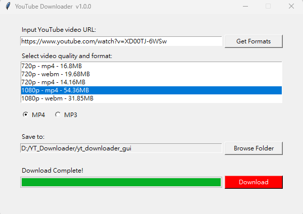

# YouTube Downloader GUI

A lightweight Python GUI tool to download YouTube videos in MP4 or MP3 format using `yt-dlp` and `ffmpeg`.

## Download

Click [yt_download_gui.zip](https://github.com/alanlin0922/yt_downloader_gui/releases) to download the app source code.

Unzip the folder and run `yt_gui.py` (requires Python installed).

## Features

- Download **MP4 (video)** or **MP3 (audio only)**
- Choose quality (e.g., 1080p, 720p, etc.)
- Select output folder
- View real-time download progress
- Uses `yt-dlp` + `ffmpeg` for best compatibility

## UI Preview



## How to Use

1. Open Terminal or Command Prompt
2. Navigate to the unzipped folder
3. Run:
```bash
python yt_gui.py
```
4. Paste the YouTube URL
5. Choose quality & format (MP4/MP3)
6. Select the download folder
7. Click "Download"

## Setup Instructions (Windows / macOS)

1. Install Python 3.8+
[https://www.python.org/downloads/](https://www.python.org/downloads/)
2. Install required package
```bash
pip install yt-dlp
```
3. Install ffmpeg

**For Windows:**
- `ffmpeg.exe` is already included in the downloaded zip (do not delete it)
- Make sure `ffmpeg.exe` is placed in the same folder as `yt_gui.py`

Or download manually: [https://www.gyan.dev/ffmpeg/builds/](https://www.gyan.dev/ffmpeg/builds/)

**For macOS:**
```bash
brew install ffmpeg
```

## For Developers

You’re welcome to modify or extend the app using the included `yt_gui.py`.

Version control and updates are managed on this GitHub repository.